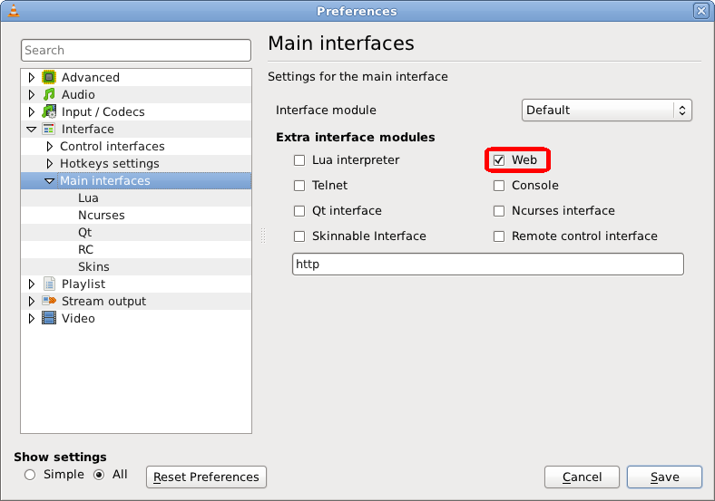
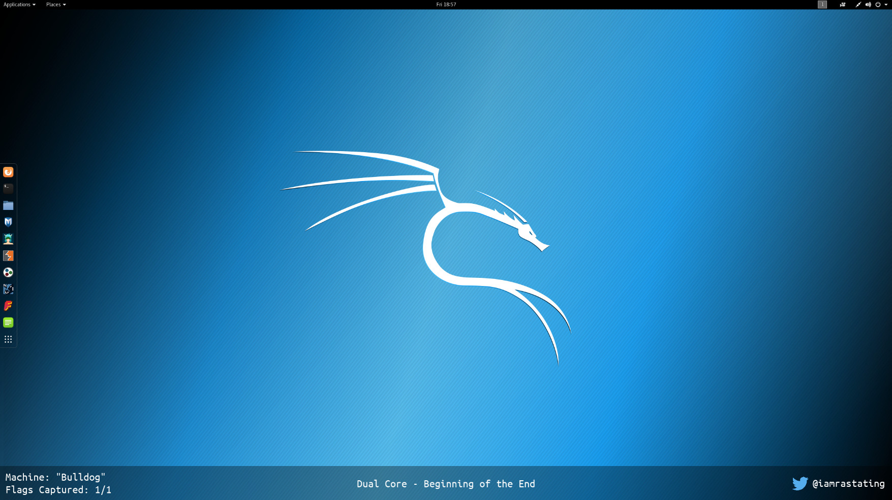

Prerequisites
=============
To run this script, ensure you are running Ruby 2.5 or higher. The [Nokogiri](https://github.com/sparklemotion/nokogiri) and [Typhoeus](https://github.com/typhoeus/typhoeus) gems must be installed too:

```shell_session
$ gem install nokogiri
$ gem install typhoeus
```

In addition to this, the VLC web interface will need to be enabled and configured with a password. To do this, go into the `Main interfaces` menu in the VLC preferences and enable the `Web` option:



The password can be set in the `Lua` section found under `Main interfaces`.

Running The Script
==================
The script accepts one argument, which is the path to the text file to save the currently playing track to. For example, to save to `/tmp/test.txt`, the script would be executed using:

```shell_session
$ ruby vlc_to_obs.rb /tmp/test.txt
```

After launching the script, you will be prompted for the password used to configure the VLC web interface. After entering this, the script will poll the web interface once every 5 seconds to determine what song is currently playing.

The output to the terminal will show the currently playing song as the track changes:

```shell_session
╭─rastating ~ ‹ruby-2.5.1›
╰─$ ruby vlc_to_obs.rb /tmp/test.txt
VLC Server Password:
[-] Now playing: Dual Core - Beginning of the End
[-] Now playing: Dual Core - Hostage Down
[-] Now playing: Dual Core - Dull Boy
```

Setting Up OBS
==============
To read the file in OBS, add a new `Text` source to your scene and enable the `Read from file` option and browse to the file that `vlc_to_obs` is writing to.

If setup correctly, the file contents will be displayed on screen:


